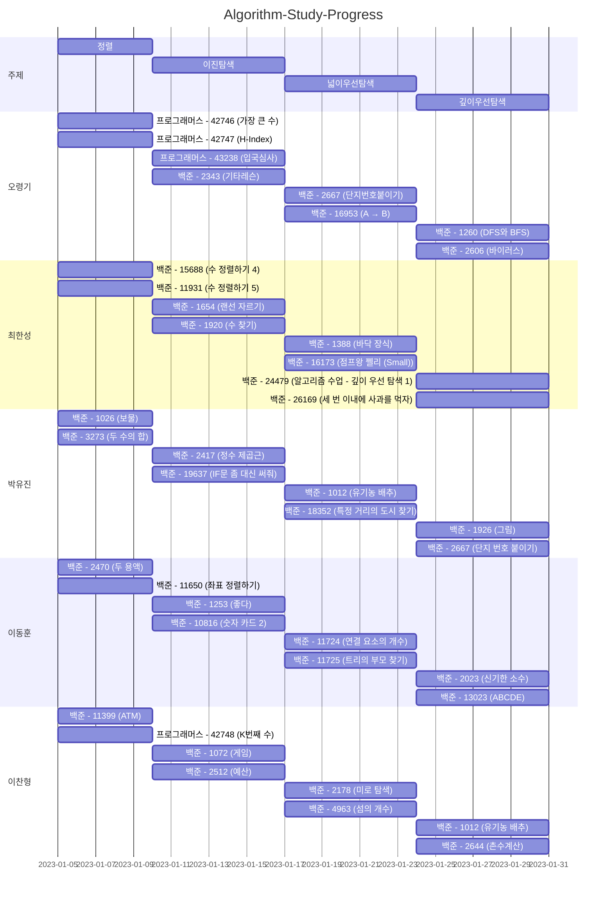

# Algorithm-Wiki

## Member
|이름|Solved.ac|
|--|--|
|[오령기](https://github.com/ryeongee)||
|[최한성](https://github.com/hansung0904)||
|[박유진](https://github.com/Iam-YJ)||
|[이동훈](https://github.com/darkblose)||
|[이찬형](https://github.com/LEECHANHYUNG)||

## Programming Language

## Problem Table

| 백준                                             |                                                                                                                                                | 프로그래머스                                                                   |                                                                                                                                 | 리트코드 |      |
|------------------------------------------------|------------------------------------------------------------------------------------------------------------------------------------------------|--------------------------------------------------------------------------|---------------------------------------------------------------------------------------------------------------------------------|----------|------|
| 번호                                             | 제목                                                                                                                                             | 번호                                                                       | 제목                                                                                                                              | 번호     | 제목 |
| [1026](https://www.acmicpc.net/problem/1026)   | [보물]                                                                                                                                           | [42746](https://school.programmers.co.kr/learn/courses/30/lessons/42746) | [가장 큰 수]                                                                                                                        |          |      |
| [2343](https://www.acmicpc.net/problem/2343)   | [기타 레슨](https://github.com/Hell-O-Algorithm/Algorithm-Wiki/blob/main/Baekjoon/Donghun/src/main/java/com/algorithm/baekjun/sort/No2470.java)    | [42747](https://school.programmers.co.kr/learn/courses/30/lessons/42747) | [H-Index](https://github.com/Hell-O-Algorithm/Algorithm-Wiki/blob/main/Programmers/Ryeongee/Programmers%20(lv2)%20H-index.java) |          |      |
| [2470](https://www.acmicpc.net/problem/2470)   | [두 용액](https://github.com/Hell-O-Algorithm/Algorithm-Wiki/blob/main/Baekjoon/Donghun/src/main/java/com/algorithm/baekjun/sort/No2470.java)     | [42747](https://school.programmers.co.kr/learn/courses/30/lessons/42747) |  |          |      |
| [3273](https://www.acmicpc.net/problem/3273)   | [두 수의 합]                                                                                                                                       | [42748](https://school.programmers.co.kr/learn/courses/30/lessons/42748) | [K번째 수](https://github.com/Hell-O-Algorithm/Algorithm-Wiki/blob/main/Programmers/Ryeongee/K%EB%B2%88%EC%A7%B8%EC%88%98.java)    |          |      |
| [11399](https://www.acmicpc.net/problem/11399) | [ATM]                                                                                                                                          | [43238](https://school.programmers.co.kr/learn/courses/30/lessons/43238) | [입국심사](https://github.com/Hell-O-Algorithm/Algorithm-Wiki/blob/main/Programmers/Ryeongee/src/main/java/com/example/demo/programmers/Programmers43238.py)                    |          |      |
| [11650](https://www.acmicpc.net/problem/11650) | [좌표 정렬하기](https://github.com/Hell-O-Algorithm/Algorithm-Wiki/blob/main/Baekjoon/Donghun/src/main/java/com/algorithm/baekjun/sort/No11650.java) |                                                                          |                                                                                                                                 |          |      |
| [11931](https://www.acmicpc.net/problem/11931) | [수 정렬하기 4]                                                                                                                                     |                                                                          |                                                                                                                                 |          |      |
| [15688](https://www.acmicpc.net/problem/15688) | [수 정렬하기 5]                                                                                                                                     |                                                                          |                                                                                                                                 |          |      |
| [1920](https://www.acmicpc.net/problem/1920)   | [수 찾기]                                                                                                                                         |                                                                          |                                                                                                                                 |          |      |
| [1654](https://www.acmicpc.net/problem/1654)   | [랜선 자르기]                                                                                                                                       |                                                                          |                                                                                                                                 |          |      |
| [2417](https://www.acmicpc.net/problem/2417)   | [정수 제곱근]                                                                                                                                       |                                                                          |                                                                                                                                 |          |      |
| [19637](https://www.acmicpc.net/problem/19637) | [IF문 좀 대신 써줘]                                                                                                                                  |                                                                          |                                                                                                                                 |          |      |
| [2512](https://www.acmicpc.net/problem/2512)   | [예산]                                                                                                                                           |                                                                          |                                                                                                                                 |          |      |
| [1072](https://www.acmicpc.net/problem/1072)   | [게임]                                                                                                                                           |                                                                          |                                                                                                                                 |          |      |
| [10816](https://www.acmicpc.net/problem/10816) | [숫자 카드 2]                                                                                                                                      |                                                                          |                                                                                                                                 |          |      |
| [1253](https://www.acmicpc.net/problem/1253)   | [좋다]                                                                                                                                           |                                                                          |                                                                                                                                 |          |      |
| [1388](https://www.acmicpc.net/problem/1388)   | [바닥 장식]                                                                                                                                        |                                                                          |                                                                                                                                 |          |      |
| [16173](https://www.acmicpc.net/problem/16173) | [점프왕 쩰리 (Small)]                                                                                                                               |                                                                          |                                                                                                                                 |          |      |
| [11724](https://www.acmicpc.net/problem/11724) | [연결 요소의 개수]                                                                                                                                    |                                                                          |                                                                                                                                 |          |      |
| [11725](https://www.acmicpc.net/problem/11725) | [트리의 부모 찾기]                                                                                                                                    |                                                                          |                                                                                                                                 |          |      |
| [18352](https://www.acmicpc.net/problem/18352) | [특정 거리의 도시 찾기]                                                                                                                                 |                                                                          |                                                                                                                                 |          |      |
| [1012](https://www.acmicpc.net/problem/1012)   | [유기농 배추]                                                                                                                                       |                                                                          |                                                                                                                                 |          |      |
| [2178](https://www.acmicpc.net/problem/2178)   | [미로 탐색]                                                                                                                                        |                                                                          |                                                                                                                                 |          |      |
| [4963](https://www.acmicpc.net/problem/4963)   | [섬의 개수]                                                                                                                                        |                                                                          |                                                                                                                                 |          |      |
| [16953](https://www.acmicpc.net/problem/16953) | [A → B]                                                                                                                                        |                                                                          |                                                                                                                                 |          |      |
| [2667](https://www.acmicpc.net/problem/2667)   | [단지번호붙이기]                                                                                                                                      |                                                                          |                                                                                                                                 |          |      |
| [1260](https://www.acmicpc.net/problem/1260)   | [DFS와 BFS]                                                                                                                                     |                                                                          |                                                                                                                                 |          |      |
| [2606](https://www.acmicpc.net/problem/2606)   | [바이러스]                                                                                                                                         |                                                                          |                                                                                                                                 |          |      |
| [1926](https://www.acmicpc.net/problem/1926)   | [그림]                                                                                                                                           |                                                                          |                                                                                                                                 |          |      |
| [24479](https://www.acmicpc.net/problem/24479) | [알고리즘 수업 - 깊이 우선 탐색 1]                                                                                                                         |                                                                          |                                                                                                                                 |          |      |
| [26169](https://www.acmicpc.net/problem/26169) | [세 번 이내에 사과를 먹자]                                                                                                                               |                                                                          |                                                                                                                                 |          |      |
| [13023](https://www.acmicpc.net/problem/13023) | [ABCDE]                                                                                                                                        |                                                                          |                                                                                                                                 |          |      |
| [2023](https://www.acmicpc.net/problem/2023)   | [신기한 소수]                                                                                                                                       |                                                                          |                                                                                                                                 |          |      |
| [1012](https://www.acmicpc.net/problem/1012)   | [유기농 배추]                                                                                                                                       |                                                                          |                                                                                                                                 |          |      |
| [2644](https://www.acmicpc.net/problem/2644)   | [촌수계산]                                                                                                                                         |                                                                          |                                                                                                                                 |          |      |

### 스터디 일정

